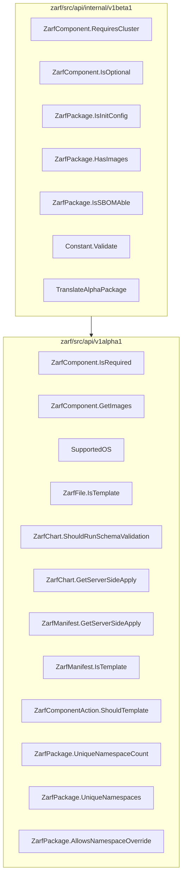

# ASTeroid Mermaid

This app maps public/exported functions in a package
to other intra packages that it imports
- "intra package" means a package that exists within the same module

Below is expected output from subset of Zarf source code; this shows that `v1alpha1` imports `v1beta1` (and showing all Public functions):


## Run Locally

```bash
git clone --recurse-submodules https://github.com/Holius/ASTeroidMermaid.git
cd ASTeroidMermaid
# dir is relative/absolute path to Go code
# module is module name from go.mod beloning to the dir
go run . --dir zarf/src/internal --module github.com/zarf-dev/zarf
# note the above command only processes a subset of "zarf"
# provide the root directory of code to process entire codebase
cat out.mermaid
```

The output can pasted into [mermaid.live](https://mermaid.live/) for quick rendering.

Change `main.go` to point to a different directory with Go Module and change `moduleName` accordingly

## AWK Script

The GNU AWK script generates `expected_go_metadata.go` via `make awk`.
This file is used in regression testing.  It is a secondary method of generating metadata
to verify the Go code in different way with the belief that multiple methods of verification
is better than one.

## Tests

The expected outputs can be found in the `expected_*.go` files.  This was done to keep the actual `*_test.go` files lean.

```go
go test .
```