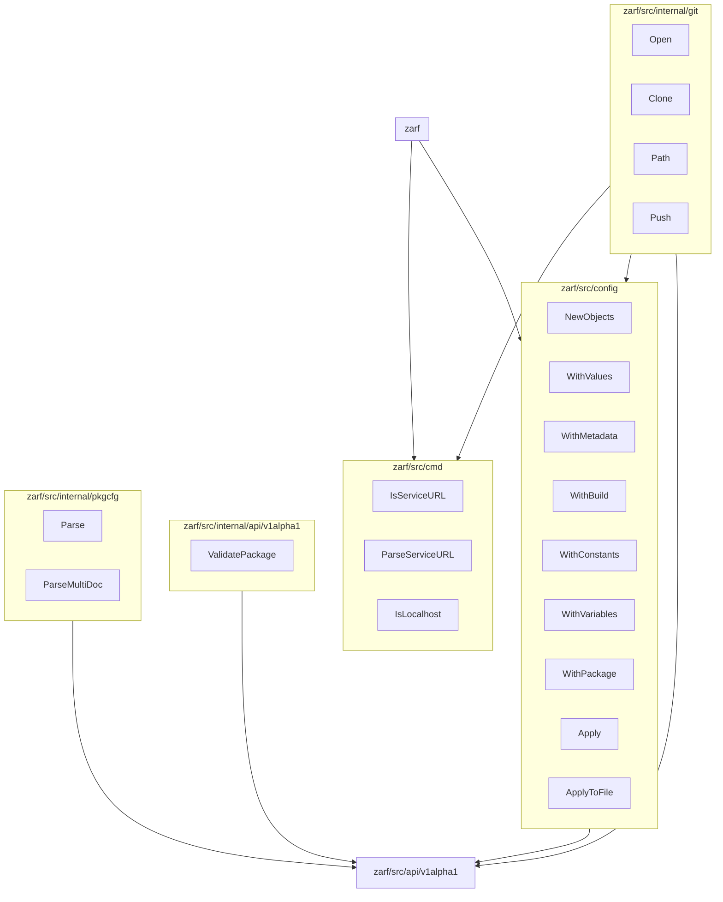

# ASTeroid Mermaid

This app maps public/exported functions in a package
to other intra packages that it imports
- "intra package" means a package that exists within the same module

Below is expected test output from fake package data inspired by Zarf source code:


Note that `zarf/src/api/v1alpha1` is erroneously missing from the mock GoPackagedata, </br>
so it does not show any exported functions which is possible to happen in a real Go Module </br>
since it's possible to only import exported variables.

## Run Locally

```bash
git clone --recurse-submodules https://github.com/Holius/ASTeroidMermaid.git
cd ASTeroidMermaid
go run .
cat out.mermaid
```

The output can pasted into [mermaid.live](https://mermaid.live/) for quick rendering.

Change `main.go` to point to a different directory with Go Module and change `moduleName` accordingly

## AWK Script

The GNU AWK script was used to generate `expected_go_metadata.go`, and it required a few manual corrections
because it cannot handle edge caes like functios that are a `generic`.
It is not necessary to use it now.

## Tests

The expected outputs can be found in the `expected_*.go` files.  This was done to keep the actual `*_test.go` files lean.

```go
go test .
```